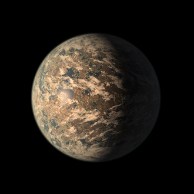

<div align="center">


# 🛸 OrbitCore

### Sonda Veleiro Solar de Exploração de Exoplanetas

*"Transforme a luz em possibilidades."*

🏆 **Projeto CAMPEÃO — 1º lugar na Global Solution 2026 da FIAP** 🏆


**[🌐 Acessar o Site](https://iantassiotto.github.io/Projeto_OrbitCore_site/index.html)** · **[🎥 Assistir ao Vídeo](https://www.youtube.com/watch?v=8CI5FU4M9v0)**

</div>

---

## 🎥 Vídeo do Projeto

Assista à apresentação cinematográfica da missão OrbitCore:

<div align="center">

[](https://www.youtube.com/watch?v=8CI5FU4M9v0)

**▶️ https://www.youtube.com/watch?v=8CI5FU4M9v0**

</div>

---

## 📖 Sobre o Projeto

E se a luz das estrelas pudesse nos levar a outros mundos?

A **OrbitCore** é uma sonda autônoma movida por uma **vela solar**: sem combustível, ela transforma a radiação estelar em movimento e navega até o sistema **TRAPPIST-1**, a 40 anos-luz da Terra. Lá, identifica cada um dos 7 planetas por **RFID** e analisa sua habitabilidade — temperatura, gravidade, atmosfera, período orbital e o Índice de Similaridade com a Terra (ESI) — em busca daquele capaz de abrigar vida.

Este projeto foi desenvolvido para a **Global Solution 2026 da FIAP**, sob o tema *"Indústria Espacial: O Código que Move o Universo"*, e conquistou o **1º lugar**.

O OrbitCore é uma **prova de conceito (PoC)**: ele simula uma missão espacial real usando hardware acessível, unindo ciência de verdade (dados da NASA e do telescópio James Webb) a tecnologias que qualquer estudante pode reproduzir.

---

## 🛰️ O Protótipo

<div align="center">

</div>

O protótipo representa a sonda veleiro solar em escala. A grande superfície reflexiva é a **vela solar** — feita de material metalizado, ela capta os fótons emitidos pela estrela. No centro fica o **corpo da sonda**, que abriga a eletrônica: o microcontrolador Arduino, o leitor RFID, o LED RGB, o buzzer e o módulo de comunicação sem fio.

Na missão real, a vela seria feita de Mylar ou Kapton metalizado (com poucos micrômetros de espessura) e a sonda carregaria sensores científicos. Aqui, o conceito é demonstrado de forma tangível e funcional.

---

## ⚙️ Como Funciona — Arquitetura em 3 Camadas

O OrbitCore é um sistema completo, dividido em três camadas que trabalham juntas:

### 1️⃣ Hardware IoT (Arduino + RFID)
A sonda física. Um **Arduino UNO** controla um leitor **RFID**, um **LED RGB**, um **buzzer** e um relógio de tempo real (**RTC**). Cada planeta é representado por uma tag RFID com uma assinatura única. Quando a sonda "entra em órbita" de um planeta, ela lê a tag, sinaliza com luz e som, e grava os dados na memória permanente (**EEPROM**).

### 2️⃣ Central de Controle (Python)
O cérebro analítico da missão. Recebe a telemetria da sonda via comunicação sem fio (**Bluetooth**) e processa os dados aplicando **modelagem matemática real**: a 3ª Lei de Kepler para as órbitas, o cálculo do ESI para habitabilidade, e funções potência, exponencial, logarítmica e trigonométrica para simular a vela solar, a datação dos planetas, o brilho da estrela e as trajetórias orbitais. Gera gráficos com **Matplotlib**.

### 3️⃣ Site Institucional (HTML/CSS/JS)
O portal público da missão — inspirado nos sites de missões da NASA. Apresenta a sonda, seus componentes, o objetivo científico e os resultados da análise dos 7 planetas. Inclui um emulador com visualização 3D do sistema TRAPPIST-1 e o circuito Arduino funcionando.

---

## 🪁 A Vela Solar — A Física por Trás

Como uma sonda viaja 40 anos-luz **sem combustível**? A resposta é a coisa mais abundante do universo: a **luz**.

A luz é feita de **fótons** — partículas sem massa. Mesmo sem massa, cada fóton carrega um empurrão minúsculo (momento). Sozinho, um fóton não move nada. Mas quando bilhões deles atingem a vela reflexiva ao mesmo tempo, sem parar, esse empurrão se acumula. A vela **reflete** a luz de volta, e isso praticamente **dobra a força**. Sem atrito no vácuo, a sonda acelera continuamente.

É o mesmo princípio da missão real **LightSail 2** (The Planetary Society). No código Python (opção 7), essa força é calculada com a Lei do Inverso do Quadrado: quanto mais longe da estrela, mais fraca a luz — e a aceleração cai proporcionalmente.

---

## 🌌 O Sistema TRAPPIST-1

<div align="center">

<br/>
<sub>Ilustração: NASA/JPL-Caltech</sub>
</div>

O **TRAPPIST-1** é um dos sistemas planetários mais extraordinários já descobertos. Fica a cerca de **40 anos-luz** da Terra, na constelação de Aquário, e leva o nome do telescópio TRAPPIST (no Chile), que detectou os primeiros planetas em 2016. Em fevereiro de 2017, a NASA anunciou o sistema completo: **7 planetas rochosos** do tamanho da Terra.

O que o torna tão especial:

- **Uma estrela anã vermelha ultrafria.** A TRAPPIST-1 tem apenas ~9% da massa do Sol e é pouco maior que Júpiter. É bem mais fria e apagada que o nosso Sol.
- **Estrela de vida longuíssima.** Anãs vermelhas queimam seu combustível muito devagar — podem brilhar por **trilhões de anos**, enquanto o Sol viverá "apenas" ~10 bilhões. Isso dá tempo de sobra para a vida surgir e evoluir.
- **7 mundos rochosos.** Todos são planetas sólidos, de tamanho parecido com a Terra — não gigantes gasosos.
- **Sistema compacto.** Todas as órbitas cabem dentro da órbita de Mercúrio. Os planetas estão muito próximos entre si.
- **Vários na zona habitável.** Três a quatro planetas orbitam na região onde a água líquida pode existir.
- **Todos tidally locked.** Cada planeta mantém sempre a mesma face voltada para a estrela — um lado é dia eterno, o outro, noite eterna.

### Os 7 Planetas

| Planeta | Raio (Terra) | Massa (Terra) | Gravidade | Temp. (°C) | Período (dias) | ESI | Classe |
|---------|:---:|:---:|:---:|:---:|:---:|:---:|:---|
| TRAPPIST-1b | 1.116 | 1.374 | 1.10 g | 125 | 1.51 | 0.30 | Hostil |
| TRAPPIST-1c | 1.097 | 1.308 | 1.08 g | 65 | 2.42 | 0.57 | Hostil |
| TRAPPIST-1d | 0.770 | 0.388 | 0.65 g | 13 | 4.05 | 0.71 | Possível |
| **TRAPPIST-1e** | **0.920** | **0.692** | **0.95 g** | **-22** | **6.10** | **0.85** | **🌍 Habitável** |
| TRAPPIST-1f | 1.044 | 0.681 | 0.62 g | -54 | 9.21 | 0.67 | Possível |
| TRAPPIST-1g | 1.129 | 1.148 | 0.90 g | -74 | 12.35 | 0.58 | Possível |
| TRAPPIST-1h | 0.755 | 0.331 | 0.57 g | -105 | 18.77 | 0.34 | Hostil |

<sub>ESI = Earth Similarity Index (Planetary Habitability Laboratory — PHL/UPR). Períodos orbitais calculados pela 3ª Lei de Kepler e validados com dados da NASA.</sub>

---

## 🌍 TRAPPIST-1e — O Mundo Mais Promissor

<div align="center">

<br/>
<sub>Concepção artística: NASA/JPL-Caltech</sub>
</div>

De todos os mais de **5 mil exoplanetas** já descobertos pela humanidade, o **TRAPPIST-1e** é um dos candidatos mais promissores para abrigar vida. Ele reúne mais condições favoráveis do que praticamente qualquer outro mundo conhecido:

- **Tamanho quase idêntico ao da Terra.** Tem 92% do raio do nosso planeta. Quem pisasse nele sentiria praticamente o mesmo peso — a gravidade é de 0.95 g.
- **Posição ideal.** Orbita bem no meio da zona habitável. Não é um forno como os planetas internos, nem uma bola de gelo como os externos. É o ponto onde a **água líquida pode existir** na superfície.
- **Planeta rochoso.** Tem chão firme, como a Terra, e densidade que sugere água em sua composição.
- **Estrela de vida longa.** Orbita uma anã vermelha, que oferece bilhões (ou trilhões) de anos de estabilidade.
- **ESI de 0.85** — um dos mais altos já registrados entre todos os exoplanetas conhecidos.

Por reunir esses fatores, o TRAPPIST-1e tem a **capacidade de abrigar seres vivos**. Pode conter vida que já exista lá e, um dia, poderia até abrigar a própria humanidade — um segundo lar para os seres terrestres, a 40 anos-luz de casa.

> ⚠️ **Nota científica:** estar na zona habitável garante apenas a *possibilidade* de água líquida — não confirma que o planeta é habitável. Fatores como atmosfera, campo magnético e efeito estufa ainda precisam ser confirmados. O TRAPPIST-1e é o **candidato mais promissor já encontrado**, não um mundo habitável confirmado.

---

## 🛠️ Tecnologias Utilizadas

| Camada | Tecnologias |
|---|---|
| **Hardware** | Arduino (C++) · RFID (MFRC522) · LED RGB · Buzzer · RTC · EEPROM · Bluetooth |
| **Central de Controle** | Python · Matplotlib · NumPy · Modelagem matemática |
| **Site** | HTML5 · CSS3 (Flexbox) · JavaScript (ES6+) |
| **Ferramentas** | Git · GitHub · NASA Eyes on Exoplanets · Wokwi |

---

## 🗂️ Estrutura do Repositório

```
Projeto_OrbitCore_site/
├── README.md
└── src/
    ├── assets/
    │   ├── orbitcore-prototipo.jpg      <- imagem do prototipo (NOVA)
    │   ├── trappist-1-sistema.jpg       <- imagem do sistema (NOVA)
    │   ├── earth.png
    │   ├── favicon.svg
    │   ├── prisma_logo_cosmica.jpeg
    │   ├── TRAPPIST_1_SUN.webp
    │   ├── TRAPPIST-1b.png  ->  TRAPPIST-1h.png
    │   └── TRAPPIST-1e.png
    ├── css/                             (16 arquivos — base, hero, cards, etc.)
    ├── js/
    │   └── script.js                    (interatividade, quiz e emulador)
    └── pages/
        ├── missao.html
        ├── trappist-1.html
        ├── emulador.html
        ├── glossario.html
        └── prisma.html
```

> 💡 Se quiser, você também pode adicionar aqui as pastas `central-de-controle/` (com o `orbitcore_app.py`) e `arduino/` (com o código `.ino` da sonda), transformando o repositório no hub completo das três camadas.

---

## 🚀 Páginas do Site

| Página | Conteúdo |
|---|---|
| **Início** (`index.html`) | Apresentação geral da missão e chamada para as seções |
| **A Missão** (`missao.html`) | Componentes da sonda, como funciona, fórmulas e códigos |
| **TRAPPIST-1** (`trappist-1.html`) | Catálogo dos 7 planetas, ESI, atmosfera e comparações |
| **Emulador** (`emulador.html`) | Visualização 3D (NASA) + circuito Arduino em tempo real |
| **Equipe PRISMA** (`prisma.html`) | Integrantes, funções e contribuições |
| **Glossário** (`glossario.html`) | Definições dos termos técnicos e científicos |

---

## 🌍 ODS Contemplados

- **ODS 9** — Indústria, Inovação e Infraestrutura *(principal)*
- **ODS 13** — Ação Contra a Mudança Global do Clima *(secundária)*

---

## 👨‍🚀 Equipe PRISMA

| Nome | RM | Responsabilidade |
|------|:---:|---|
| Ian Felipe Tassiotto Gomes | 570812 | Tech Lead |
| João Gabriel Vieira Mesquita | 573685 | Engenheiro de Software & Storyteller |
| Hyan Hideo Silveira Teodoro Ayabe | 571005 | Cientista & Front-End |
| Elizeu Antônio de Queiroz | 569433 | Designer |

**FIAP — Engenharia de Software — Global Solution 2026**

---

## 📚 Referências Científicas

- [NASA Exoplanet Archive](https://exoplanetarchive.ipac.caltech.edu/)
- [NASA Eyes on Exoplanets](https://eyes.nasa.gov/apps/exo)
- [NASA — TRAPPIST-1](https://science.nasa.gov/trappist-1/)
- [Grimm et al. (2018) — Nature of TRAPPIST-1 planets](https://www.aanda.org/articles/aa/full_html/2018/05/aa32233-17/aa32233-17.html)
- [Agol et al. (2021) — The Planetary Science Journal](https://iopscience.iop.org/article/10.3847/PSJ/abd022)
- [Planetary Habitability Laboratory (PHL/UPR)](https://phl.upr.edu/)

---

<div align="center">

*"Transforme a luz em possibilidades."*

**— Equipe PRISMA**

Projeto acadêmico — Global Solution 2026 — FIAP.
Todos os direitos reservados à Equipe PRISMA.

</div>
